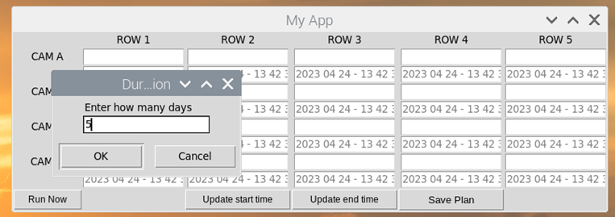
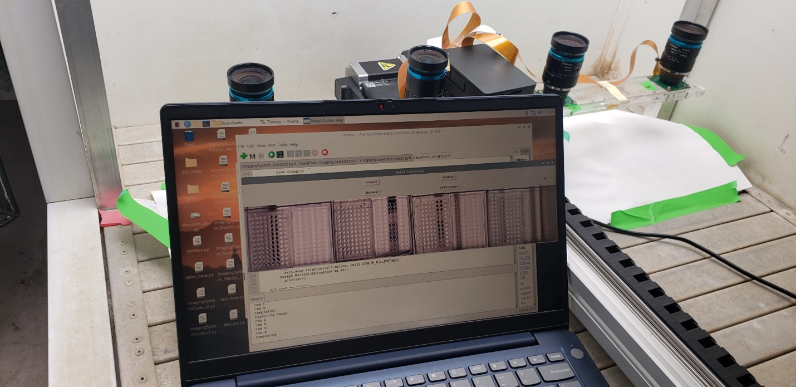

# Running-Imaging-App
Steps for Controlling Autonomous Tracking System

[1. Connecting to the Image Capturing Board](#1-connecting-to-the-image-capturing-board)

[2. Running Imaging Planner](#2-running-imaging-planner)

[3.	Schedule runs with crontab](#3-schedule-runs-with-crontab)

[4.	Run the image capturing calibration](#4-run-the-image-capturing-calibration)

[5. Storing files into Symbiont Server](#5-storing-files-into-symbiont-server)

  
# 1 Connecting to the Image Capturing Board

a)	Download and Install UtorVPN, Cisco (if you do not have it already installed in your computer)
Here is the link for UtorVPN. Depending on your device, select the proper operating system, install The Cisco AnyConnect Client with the proper settings.
https://onesearch.library.utoronto.ca/ic-faq-categories/utorvpn

b)	Open VPN and connect via your UTORid and password.
An example run on Windows:
 

c)	Windows->Remote Desktop Connection
In order to connect the Raspberry Pi of the imaging system, you need to run the Remote Desktop Connection.
Press windows button and write “remote” in the search bar.

 

Enter the IP address of the RPi, and click connect.
IP: ---------------

d)	Login Raspberry Pi using the User ID and password

a.	User: -----
b.	Password: --------
 

# 2 Running Imaging Planner

https://github.com/tiagolins2/Running-Imaging-App/assets/95873122/afac327b-5777-40b3-84b5-72d762619946

a)	First, open DuckPlate_imaging.py

 

b)	This will open the code. Click the run button 
  

c)	The following window will show up. Define each field using the dropdown options:
Number of photos: How many repeat photos of the same area you want
Number of rows: How many rows on the stage to be covered (Please check to make sure the way for the linear stage to move is clear!)
Mode: Photo or video. For now I have only enabled photo to work
Press Okay once done 

 

d)	Once you press Okay, a new window will appear. Before you name them, first define a start time and end time for the image capturing.
 
Click on *Update start time*

 

e)	Next, click on Update end time

 

f)	You will be asked to enter how many days you want to run your experiment for (i.e. 5 days)

 
g)	You can then name each area/pair of plates, and change the dates according to your experiment design. Here I named them as numbers going from 1 to 20.

 

h)	Once you are done filling out your information, click on Save Plan. As an option, you can also test your plan now by pressing “Run Now” button (*see video below*) allowing you to see the results in the app window, or running the saved plan to view the output in the board.

https://github.com/tiagolins2/Running-Imaging-App/assets/95873122/62d48762-8757-47f0-880b-7e52647a5fb5

https://github.com/tiagolins2/Running-Imaging-App/assets/95873122/6f33d427-7271-4777-80e9-22f9b66dcb37

i)	Once done, you can now close the app.
The next step is to schedule when your plates should be imaged.

# 3 Schedule runs with crontab

https://github.com/tiagolins2/Running-Imaging-App/assets/95873122/2b2375e7-f732-4141-a80f-3a50a3766ef8

a)	In order to set the a pre-defined date to run the code automatically, we must run crontab code from the Raspberry Pi Terminal. Raspberry Pi Terminal can be opened using the icon on the task bar.

 

b)	On the terminal, write “crontab -l” and press enter to view any scheduled task for the Raspberry Pi. Note that any line starting with “#” is commented out, which means it is inactive. In the image below, all lines are commented out, hence, there is no active scheduled task for this RPi system.
 

c)	In order to edit this crontab tasks, write “crontab -e” command on the Pi Terminal. Once you hit enter, you’ll see the crontab becomes editable. 
 

d)	Delete the hashtag “#” in front of the final line of code so as to make it an active task. The active codes becomes white so once you delete the hashtag at the beginning of the line, the line will turn from blue to white. Once you made any change on the crontab, you should press Ctrl+X to save and exit. After pressing Ctrl+X, it’ll ask you to save it. Press Y to save. Then, it’ll ask you where to save the crontab. Do not change the directory or file name and press Enter.
  
  

  
e)	Note that this code is set to run at 16:00 every day once you delete the hashtag. You can set the time by changing 00 and 18 in the code. If you want more than one arbitrary operations, you can simply copy and paste this line of code, and enter another time. If you want to periodically run any command/code/script, there are other available codes you can find over the net (https://crontab.guru/). 
f)	Once you made your changes in crontab and save and exit using Ctrl+X, you will return to Pi Terminal. To double check your scheduled tasks, you can run crontab -l command to see your changed crontab.
 

# 4 Run the image capturing calibration

https://github.com/tiagolins2/Running-Imaging-App/assets/95873122/50a5f119-324b-46e8-a272-439973160cda

a)	To ensure that there is proper alignment between the cameras and the stages, and to also reduce tilting in the images, you can run the calibration app. Open the file named “DuckPlate_imaging_calibrate.py”

 

b)	Once open, click the green Run button

 

c)	This will open the small window app. First, press capture image to view how the cameras are capturing the stage above it.

 

d)	After about 30 seconds, the window will be automatically updated with the photos that have been just taken, as shown below.
 

 

# 5 Storing files into Symbiont Server

You can also store files saved in the board into the server under your account.  
To do this, you can open the command prompt in the raspberry Pi, and write "expect autom2.exp" (see below) 

  

It will ask you for your user name in Symbiont, a folder name where you want to store all the files (i.e. "test1"), and your password (which won't show up as you type). This will then create the folder in your account and save all the images (from cameras A to D) into the folder.

